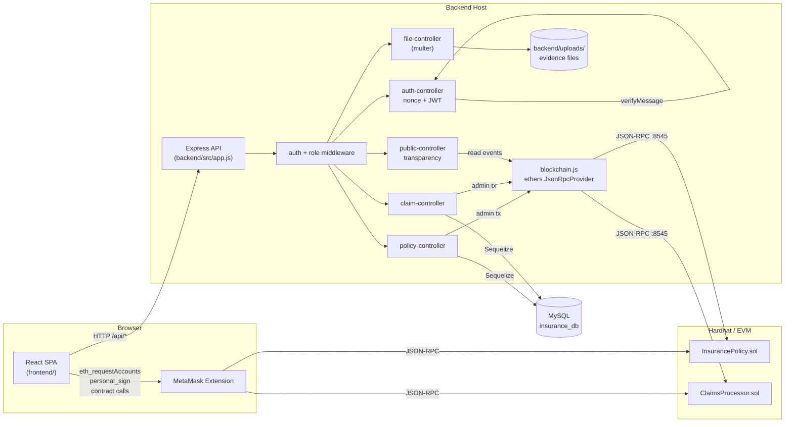
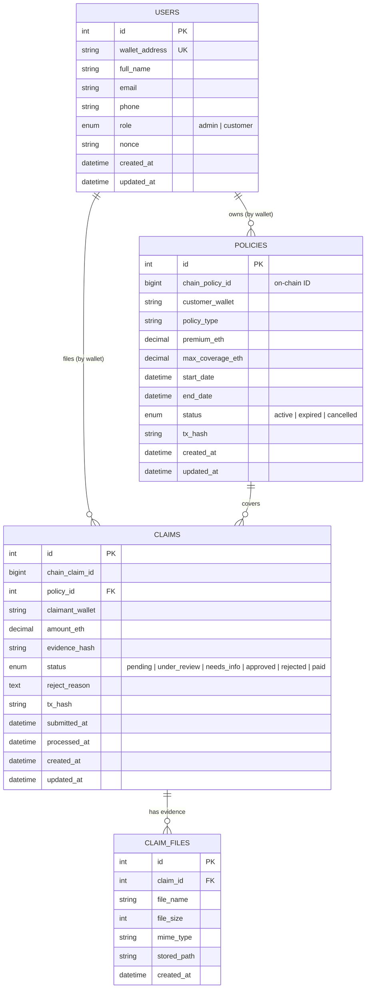
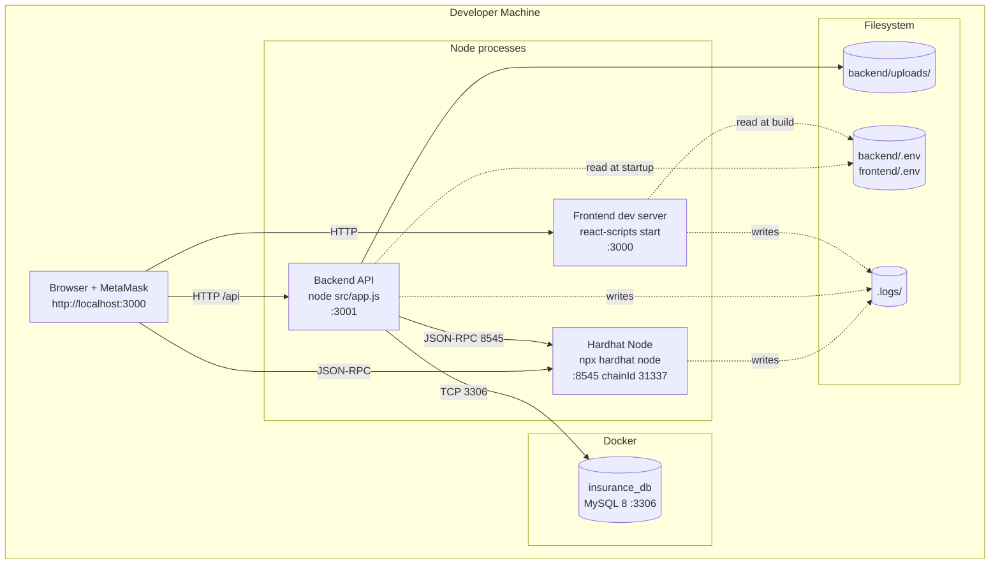

# InsurChain — Architecture

Tài liệu mô tả kiến trúc tổng thể bằng 3 diagrams (Component, ERD, Deployment) và giải thích các functions chính của repo.

---

## 1. Component Diagram

Mô tả các thành phần phần mềm và cách chúng giao tiếp.



**Luồng chính:**
- Frontend gọi MetaMask trực tiếp để ký nonce và gửi tx on-chain (customer submit claim, admin trigger payout từ admin UI).
- Backend dùng `PRIVATE_KEY` của admin để gọi các function `onlyAdmin` (vd. `createPolicy`) khi API admin được gọi.
- Metadata (status, files, user profile) lưu MySQL; nguồn sự thật về tiền/quyền sở hữu vẫn ở on-chain.

---

## 2. ERD (MySQL schema)



Quan hệ off-chain ↔ on-chain liên kết qua `chain_policy_id` / `chain_claim_id` và địa chỉ ví (`customer_wallet`, `claimant_wallet`).

---

## 3. Deployment Diagram

Mô tả các node vật lý/logical khi chạy local stack qua `./scripts/start-all.sh`.



**Ports**

| Service   | Port  | Process                  |
|-----------|-------|--------------------------|
| Frontend  | 3000  | react-scripts            |
| Backend   | 3001  | node src/app.js          |
| Hardhat   | 8545  | npx hardhat node         |
| MySQL     | 3306  | docker compose service   |

---

## 4. Repo functions — giải thích

### `contracts/` (Solidity + Hardhat)

| File | Mô tả |
|------|------|
| `contracts/InsurancePolicy.sol` | Quản lý policy on-chain. `createPolicy` (onlyAdmin), `cancelPolicy`, `isValid`, `getPolicy`, `getCustomerPolicies`. |
| `contracts/ClaimsProcessor.sol` | Submit/approve/reject/pay claim. `submitClaim` (chỉ chủ policy), `approveClaim` + payout ETH (onlyAdmin), `rejectClaim`, `updateStatus`. |
| `scripts/deploy.js` | Deploy 2 contract, seed 0.5 ETH vào ClaimsProcessor, in địa chỉ ra stdout. |
| `hardhat.config.js` | Networks: `localhost` (127.0.0.1:8545), `sepolia` (RPC env). |

### `backend/` (Express + Sequelize)

| Module | Chức năng |
|--------|-----------|
| `src/app.js` | Bootstrap Express, mount routes `/api/{auth,policies,claims,files,public}`, sync Sequelize. |
| `src/config/database.js` | Kết nối MySQL qua Sequelize. |
| `src/config/blockchain.js` | Tạo `ethers.JsonRpcProvider` + signer admin từ `PRIVATE_KEY`. |
| `src/models/*` | Sequelize models: `User`, `Policy`, `Claim`, `ClaimFile` + associations trong `index.js`. |
| `src/middleware/auth-middleware.js` | Verify JWT, gắn `req.user`. |
| `src/middleware/role-middleware.js` | `requireAdmin`, `requireCustomer`. |
| `src/controllers/auth-controller.js` | `getNonce`, `login` (verify signature → JWT), `getMe`. |
| `src/controllers/policy-controller.js` | List/create/get/cancel policy; create đồng bộ lên contract qua admin signer. |
| `src/controllers/claim-controller.js` | List/get claim, approve/reject (gọi contract), update status. |
| `src/controllers/file-controller.js` | Upload (multer) + serve evidence files, lưu metadata vào `claim_files`. |
| `src/controllers/public-controller.js` | Đọc events từ contract → trả lịch sử tx và stats công khai. |

### `frontend/` (React 18)

| Module | Chức năng |
|--------|-----------|
| `src/App.jsx` | Routing, AuthProvider wrapper. |
| `src/context/AuthContext.jsx` | Quản lý user + wallet, expose `connect`/`logout`. |
| `src/hooks/use-wallet.js` | Kết nối MetaMask: revoke permission + `eth_requestAccounts` để show account picker; lắng nghe `accountsChanged`, `chainChanged`. |
| `src/services/api.js` | Axios instance + JWT interceptor. |
| `src/services/auth-service.js` | Flow nonce → sign → login. |
| `src/services/{policy,claim,file,public}-service.js` | Gọi REST API tương ứng. |
| `src/contracts/*` | ABI + helper gọi contract trực tiếp từ frontend (customer submit claim). |
| `src/pages/LoginPage.jsx` | Nút "Connect MetaMask". |
| `src/pages/DashboardPage.jsx` | Tổng quan policy/claim của user. |
| `src/pages/PoliciesPage.jsx` + `PolicyDetailPage.jsx` | Xem danh sách / chi tiết policy. |
| `src/pages/ClaimsPage.jsx` + `ClaimDetailPage.jsx` + `NewClaimPage.jsx` | Quản lý claim, submit claim mới (ký tx qua MetaMask). |
| `src/pages/TransactionsPage.jsx` | Hiển thị lịch sử on-chain (transparency). |
| `src/pages/admin/*` | UI admin: tạo policy, duyệt claim, quản lý user. |
| `src/components/{layout,ui,policy,claim,admin}/*` | Components UI tái sử dụng. |

### `scripts/`

| File | Chức năng |
|------|----------|
| `start-all.sh` | One-shot khởi động: MySQL → Hardhat → deploy → seed → backend → frontend; tự ghi địa chỉ contract vào `.env`. |
| `stop-all.sh` | Kill các PID lưu trong `.logs/*.pid` và `docker compose down`. |
| `seed-demo-data.sql` | Insert user demo, policy mẫu để test ngay. |

### `docker-compose.yml`

Chỉ chứa service `mysql` (volume `mysql_data`, healthcheck `mysqladmin ping`).

---

## 5. End-to-end flows

### 5.1 Đăng nhập bằng MetaMask

```
FE → GET /auth/nonce?wallet=0x..
Backend → find-or-create user, rotate nonce, trả về
FE → personal_sign("Sign in to Insurance App: <nonce>")
FE → POST /auth/login {wallet, signature}
Backend → ethers.verifyMessage → rotate nonce → ký JWT 7d
FE → lưu token + user vào localStorage
```

### 5.2 Tạo policy (admin)

```
Admin UI → POST /api/policies (JWT admin)
policy-controller → ký tx createPolicy() bằng PRIVATE_KEY admin
→ chờ receipt → lưu chain_policy_id + tx_hash vào MySQL
→ trả về policy object
```

### 5.3 Submit claim (customer)

```
Customer → NewClaimPage upload files → POST /api/files/upload → trả claim_files IDs
Customer → MetaMask ký tx submitClaim(policyId, amount, evidenceHash)
→ chờ receipt
FE → POST /api/claims {policy_id, amount_eth, evidence_hash, tx_hash, chain_claim_id}
Backend → lưu record, link claim_files
```

### 5.4 Approve + payout (admin)

```
Admin → PATCH /api/claims/:id/approve
claim-controller → gọi approveClaim() on-chain bằng admin signer
→ contract chuyển ETH cho claimant
→ update status = 'paid', processed_at, tx_hash
```

---

## Unresolved / Notes

- Không có test suite tự động trong `backend/`; chỉ có Hardhat tests trong `contracts/test/`.
- `start-all.sh` chỉ chạy được trên Linux/macOS (dùng `sed -i`, `fuser`, `lsof`).
- Frontend chưa có production build pipeline (chỉ `react-scripts start`).
