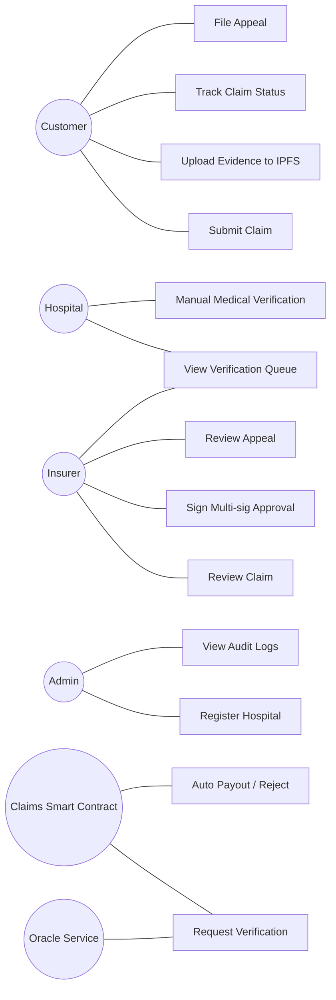
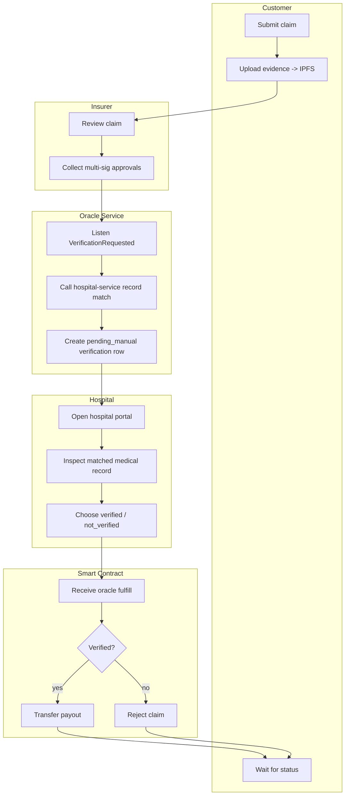
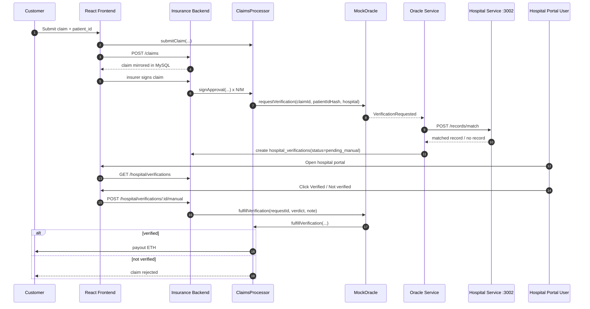
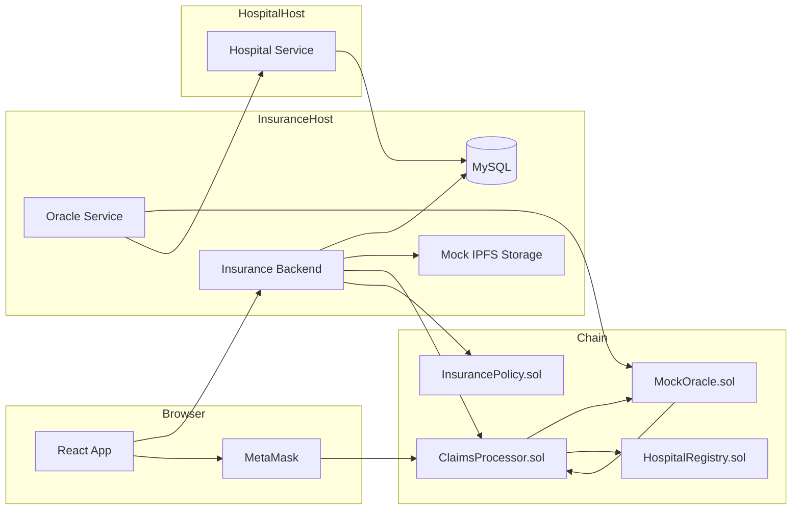
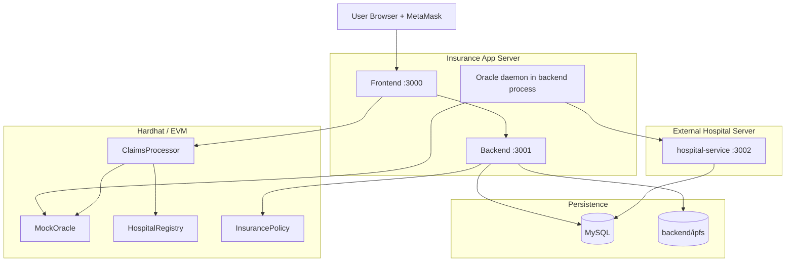
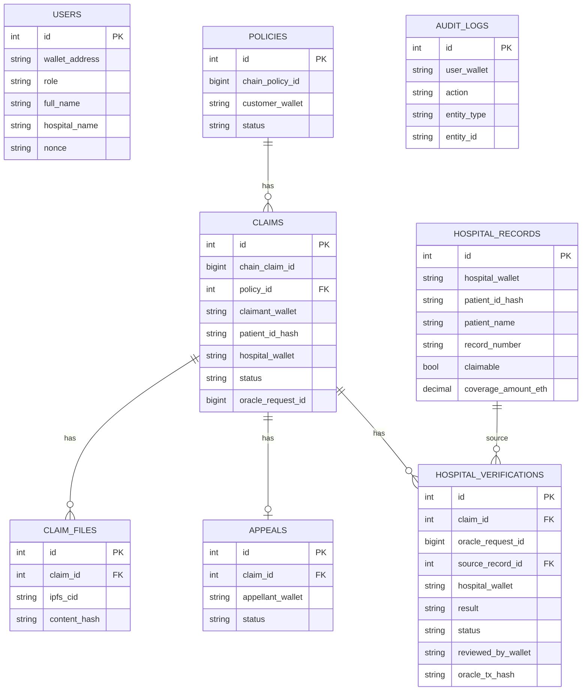

# InsurChain v3 — Architecture And Diagrams

## 1. Actor Model

- `Customer`: submit claim, upload evidence, file appeal
- `Hospital`: verify patient record manually
- `Insurer`: handle claim operations and appeal review
- `Admin`: governance, policy admin, registry, audit
- `Oracle Service`: technical bridge between chain and hospital service
- `Smart Contract`: final payout / reject authority

## 2. Use Case Diagram

## 3. Activity Diagram

## 4. Sequence Diagram

## 5. Component Diagram

## 6. Deployment Diagram

## 7. ERD

## 8. Key Design Notes

- `insurer` là actor nghiệp vụ thật, tách khỏi `admin`.
- `hospital` là actor xác minh thật, không còn random mock.
- Oracle không tự quyết đúng/sai; nó chỉ bridge dữ liệu và submit verdict đã
  được hospital user xác nhận.
- Contract vẫn là nguồn chân lý cuối cùng cho payout và final claim state.
